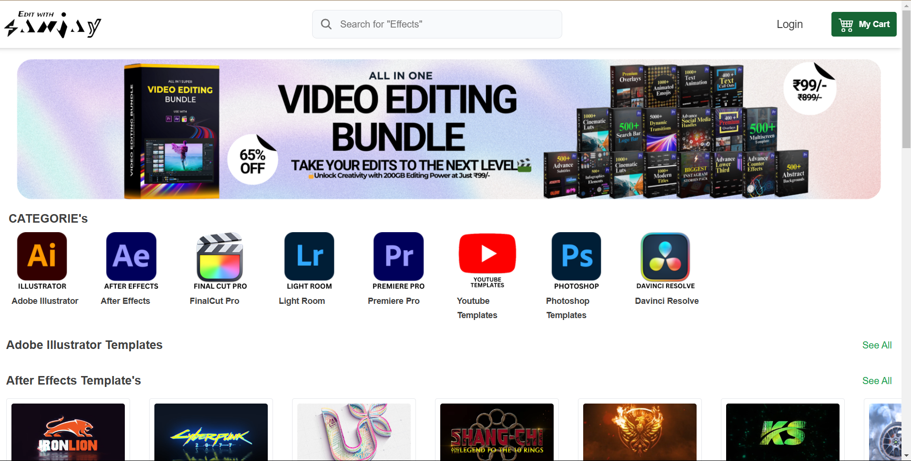

# BuyWithSanjay - E-Commerce Platform for Animation Templates

Welcome to **BuyWithSanjay**, an online e-commerce platform for purchasing high-quality animation templates. This platform is built using modern web technologies and hosted on **Netlify** with a **serverless backend** powered by **AWS Lambda**. The database and cloud storage are managed with **MongoDB** and **Cloudinary**.

## 🌐 Live Demo
[**Visit Live Website**](https://buywithsanjay.netlify.app)

## 🚀 Features
- 🔹 **Browse & Purchase** animation templates
- 🔹 **Secure Authentication & User Accounts**
- 🔹 **Fast and Scalable Backend with AWS Lambda**
- 🔹 **Cloud-based Storage with Cloudinary**
- 🔹 **MongoDB Database for Product & User Management**
- 🔹 **Seamless Payment Gateway Integration**
- 🔹 **Responsive & Intuitive UI**

---
## 🛠️ Tech Stack

### Frontend:
- **React.js** (Hosted on **Netlify**)
- **Tailwind CSS** for styling

### Backend:
- **AWS Lambda** (Serverless API)
- **Express.js** (For API routes)
- **MongoDB** (For Database Management)
- **Cloudinary** (For Image and Asset Storage)

### Additional Integrations:
- **Stripe** (For secure payments)
- **JWT Authentication** (For user security)
- **Redux Toolkit** (For state management)

---
## 🔧 Installation & Setup

1️⃣ **Clone the Repository**
```bash
git clone https://github.com/goutham469/ecommerce.git
cd ecommerce
```

2️⃣ **Install Dependencies**
```bash
npm install
```

3️⃣ **Set Up Environment Variables**
Create a `.env` file in the root directory and add:
```env
REACT_APP_API_URL=<your-backend-api-url>
REACT_APP_CLOUDINARY_URL=<your-cloudinary-url>
REACT_APP_STRIPE_KEY=<your-stripe-key>
```

4️⃣ **Run the Application**
```bash
npm start
```

---
## 📌 API Endpoints

| Method | Endpoint            | Description             |
|--------|--------------------|-------------------------|
| GET    | `/api/products`    | Get all animation templates |
| GET    | `/api/products/:id` | Get a single template details |
| POST   | `/api/auth/register` | Register a new user |
| POST   | `/api/auth/login`    | User login |
| POST   | `/api/orders` | Create a new order |

---
## 📸 Screenshots


---
## 🎯 Future Enhancements
- 🔹 AI-powered template recommendations
- 🔹 User reviews & ratings system
- 🔹 Custom animation editor

---
## 🤝 Contributing
Want to contribute? Feel free to fork the repo, make changes, and create a pull request!

```bash
git clone https://github.com/goutham469/ecommerce.git
git checkout -b production-client
```

---
## 📜 License
This project is licensed under the **MIT License**.

---
## 📬 Contact
For queries or collaboration:
- **Email:** uppinurigouthamreddy@gmail.com
- **LinkedIn:** [gouthamreddy2005](https://linkedin.com/in/gouthamreddy2005)
- **GitHub:** [@goutham469](https://github.com/goutham469)

